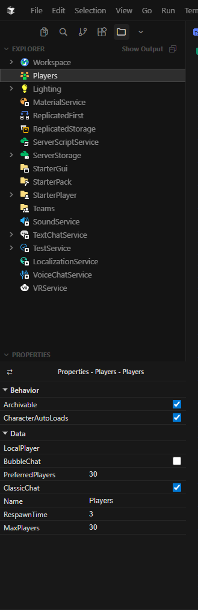

# Verde

A Roblox Studio + Properties Emulator VS Code extension.

Verde allows to view your entire datamodel from within VS Code, with operations like copy, paste, duplicate, rename, and delete for any instance.

Verde also comes with a properties window, allowing you to read and modify any properties of any instance without having to leave your editor.

Verde can be used either with a dedicated sync tool (Like Rojo/Argon/Azul) or with the newly released Script Sync + [Luau-LSP](https://github.com/JohnnyMorganz/luau-lsp) (for sourcemap generation)

## Features

- **Live Instance Tree**: View your Roblox game's instance hierarchy in VS Code
- **Script Opening**: Double-click scripts from the explorer to open them right in VS Code (works with Rojo/Argon/Azul/Luau-LSP sourcemaps)
- **Instance Operations**: Rename, duplicate, delete, copy, and paste instances
- **Properties Panel**: View and edit instance properties right from VS Code

## Requirements

- Roblox Studio with the Verde plugin installed
- A Rojo/Argon/Azul setup with sourcemap generation (for script opening functionality)

## Extension Installation

### Manually

1. Run `npm run package` in the extension directory to create a `.vsix` file
2. In VS Code, press Ctrl + Shift + P to open the command palette
3. Select "Install from VSIX..." and choose the generated `.vsix` file

### Online

[Visual Studio Marketplace](https://marketplace.visualstudio.com/items?itemName=Dvitash.verde)

## Setup

1. Install the [Verde plugin](https://create.roblox.com/store/asset/84296161836385) in Roblox Studio
2. Open your VS Code workspace
3. The extension will automatically start a WebSocket server
4. Open Roblox Studio and run your game with the plugin
5. The Roblox Explorer view should appear in VS Code

## Extension Settings

* `verde.sourcemapPath`: Path to sourcemap file (relative to workspace root) - defaults to "sourcemap.json"
* `verde.port`: Port for the WebSocket server - defaults to 9000
* `verde.host`: Host IP address for the WebSocket server - defaults to "localhost"
* `verde.autoStart`: Automatically start the server when the extension activates - defaults to true

## Usage

### Opening Scripts

1. Click on any Script, LocalScript, or ModuleScript in the Verde explorer
2. The extension will look up the file path in your sourcemap
3. The corresponding file will open in VS Code

### Instance Operations

- Right-click instances for context menu options
- Use keyboard shortcuts for quick operations:
  - `Enter`: Rename
  - `Delete`: Delete
  - `Ctrl+C`: Copy
  - `Ctrl+V`: Paste
  - `Ctrl+D`: Duplicate
  - `Ctrl+Shift+A`: Open new instance panel